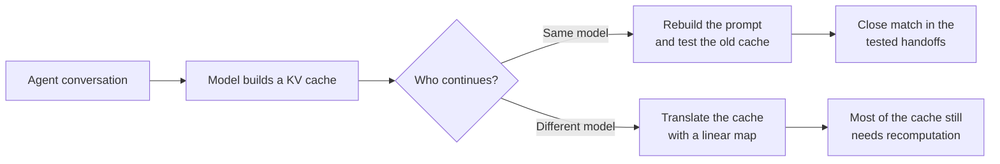

# linear-ceiling

Can one AI model reuse work another model has already done?

When a language model reads a prompt, it builds a **KV cache**: an internal record that saves it
from processing the same text again. Reusing that cache could reduce latency and cost. This
project tests when reuse is possible in real agent conversations, both when the same model
continues the work and when a different model takes over.



## Contents

- [What the experiments found](#what-the-experiments-found)
- [How the record stays auditable](#how-the-record-stays-auditable)
- [Where the data lives](#where-the-data-lives) — the three public Hugging Face datasets, including the long-context run
- [Where to go next](#where-to-go-next)
- [Setup](#setup)
- [Objective (2026-09-09)](#objective-2026-09-09)
- [What the record says (decided cells)](#what-the-record-says-decided-cells)
- [Beyond the paper](#beyond-the-paper)
- [Backups (Hugging Face)](#backups-hugging-face)
- [Docs map](#docs-map)

## What the experiments found

- **Same-model reuse survived the tested handoffs.** For the 25 shorter handoffs that fit the
  model's native context limit, the old and rebuilt caches were within the registered tolerance at
  every matched token (entry 0029). The same held for the 35 longer handoffs, 35K to 80K tokens,
  once the model's context window was extended to reach them (entry 0036), though with much less
  room to spare: deviation grows several-fold for tokens that sat beyond the native window. This is
  an ideal lower bound, not a working cache-reuse system.
- **A simple cross-model translation was not useful.** A linear map trained on generic text lost
  accuracy on agent text. At the handoff, an ideal selector still needed to recompute a median of
  92.86% of matched tokens on the shorter handoffs and 96.40% on the longer ones. Entries 0029 and
  0036 record the results.
- **Public traces cannot answer the whole cost question.** Model switches were rare in the 2,904
  public trajectories studied, and the traces omit some information needed for full cache
  accounting. The reported cost figures are bounds, not production estimates.

The practical result is narrow: a cache-aware router should first ask whether the same model will
continue. These experiments do not show that a linear map makes caches portable between models.

The current objective, every decided cell with its entry, what the positive verdict does and does
not mean, and what comes after the paper: `ledger/ledger.md` (the hypothesis table, then the
entries its cells cite) and `docs/paper/2026-09-10-lcfm-outline-v2.md`. A consolidated
`docs/status.md` is referenced in earlier drafts and has not been written; the archived form is
`docs/archive/README-2026-09-09-status.md`.

## How the record stays auditable

The repository treats each result like a registered experiment, not an editable report.

1. The research rule and thresholds are committed before a run starts.
2. A summarizer recalculates each reported number from the raw output and stops on a mismatch.
3. The numbered ledger entries are hash-chained and checked in CI, so later edits fail the build.

`ledger/ledger.md` is the source of truth for hypotheses, rules, results, and verdicts. A green test
suite proves that the tools work. It does not prove a scientific claim.

The original scope boundary remains fixed:

> The screen predicts what a linear mapper can achieve; retention asymmetry beyond that
> prediction is measured and attributed receiver-side, not explained.

## Where the data lives

Raw model outputs never enter git history. Each GPU run's tensors are backed up to a
Hugging Face dataset after the run is verified at home; the backup is transport, not evidence, and
every file is checked in both directions before it counts.

| dataset | what it holds |
|---|---|
| [`hossainpazooki/linear-ceiling-e9-2026-09-04`](https://huggingface.co/datasets/hossainpazooki/linear-ceiling-e9-2026-09-04) | the same-model handoff experiment on the 25 shorter handoffs (entries 0026–0029) |
| [`hossainpazooki/linear-ceiling-n420-2026-09-08`](https://huggingface.co/datasets/hossainpazooki/linear-ceiling-n420-2026-09-08) | the larger calibration set behind the cross-model map's sensitivity check (entries 0033–0034) |
| [`hossainpazooki/linear-ceiling-e9l-2026-09-10`](https://huggingface.co/datasets/hossainpazooki/linear-ceiling-e9l-2026-09-10) | the long-context run on the 35 longer handoffs (entries 0035–0036) |

All three datasets are public as of 2026-09-11 (`private: false`, `gated: false` from the Hub API);
no read token is needed to fetch them. Protocol R8 allows public datasets (operator ruling,
2026-09-11). Restore and verify: R8 in
`docs/gpu-experiment-protocol.md`, checked by `tools/hf_verify_backup.py <repo_id> <local_root>`.

## Where to go next

| if you want to | read |
|---|---|
| see every hypothesis, rule, result and verdict | `ledger/ledger.md` — the table, then the entries its cells cite |
| understand why the program asked these questions | `docs/gap-map.md` and `docs/2026-09-06-gap-map-revisited.md` |
| read the paper being written from this record | `docs/paper/2026-09-10-lcfm-outline-v2.md` |
| pick up the work | `docs/handoff/HANDOFF.md`, newest brief first |
| run or re-run an experiment | `CLAUDE.md` for the commands, `docs/gpu-experiment-protocol.md` for the rules |
| see what went wrong before and how it was caught | `docs/learnings/LEARNINGS.md` |
| see the older, diagram-heavy README | `docs/archive/` |

## Setup

```bash
uv venv --python 3.12 .venv
uv pip install torch --index-url https://download.pytorch.org/whl/cpu
uv pip install -e ".[dev]"
pytest
python -m linear_ceiling.seal verify && python -m linear_ceiling.lint_scope && python -m linear_ceiling.ledger_check
```

The suite runs offline on synthetic fixtures. The experiments need local data that is not in the
repository: public agent trajectories under `traces/` (rebuilt from `config/e7-manifest.json`) and
the pinned upstream repository named in `UPSTREAM.md`, which every experiment invokes by subprocess
and refuses to run against if its pin does not hold.

---

## Objective (2026-09-09)

**Ship the LCFM @ NeurIPS 2026 short paper by 2026-09-11 11:59 UTC with long context central.**
Working title: *Same weights, new positions: KV reuse at long-context agent handoffs, and the other
axis*. Outline: `docs/paper/2026-09-10-lcfm-outline-v2.md`.

The frame: a cache is a function of the context that produced it and the weights that computed it,
and two structural events change one factor each.

| axis | event | experiment | state |
|---|---|---|---|
| context | a re-rendered handoff: same tokens at new positions, new tokens at the seam | **E9** — 25 real SWE-bench handoffs up to 32K tokens | **HELD** on an oracle floor (0029); admitted to the paper (0032); freeze run passed 2026-09-09 |
| context, long | the same event at 35K–80K tokens under a YaRN-extended receiver | **E9-long** — the 35 handoffs above the prior cap | **decided** — H-E9L `HELD` (0036, 2026-09-10): median f*(τ_K) 0.0000 on all 35, bridge CARRIED; run on a rented L40S, 80 min |
| weights | a policy update under an in-flight rollout in async RL | **E-RL** | **designed, unregistered** (`docs/2026-09-02-e-rl-design.md`); the paper's contrasting direction, no figure |

One yardstick for both axes: per matched token, the centered deviation between two KV states in the
units of a cross-model mapper's R²; a token needs recompute above τ_K = 0.3186, the k = 1 mapper's
own held-out shortfall; f*(τ_K) is the fraction an oracle would recompute; HOLDS ≤ 0.15, DEGRADES
≥ 0.50 (0023). E7 supplies the handoffs and is the paper's corpus paragraph; E8 explains the cross
arm in one sentence and an appendix table.

**Two conditions decide what the paper contains, and neither is a framing choice:**

1. E9 stays in only if the co-author refutation of entries 0025–0029 is recorded before submission
   (0032's condition, carried unchanged by 0035). Not recorded at the time of writing.
2. E9-long enters only from a passing `summarize_e9 --config config/e9l.toml`, by its own entry,
   with "n scored of 35 registered" beside every number, never pooled with E9's 25.

**Tonight's sitting, in one line each.** Upstream RoPE spec so a YaRN-scaled receiver's content-space
K strips exactly (independently refuted, survives); `config/e9l.toml` with a context floor, a
configuration-bridge control, a registered run order and a prefix-checkable stopping rule;
`append_0035.py` registers all of it before the box is touched; `append_0036.py` writes the verdict
from the summarizer only. Commands: `CLAUDE.md`. Runbooks and protocol R1–R12:
`docs/gpu-experiment-protocol.md`. Newest brief: `docs/handoff/HANDOFF.md`.

## What the record says (decided cells)

| hypothesis | verdict | entries |
|---|---|---|
| H-E7a — switch-point headroom is material on public agent traces | **NOT CONFIRMED** (0.20% of spend vs a 10% cutoff, registered reading) | 0015, 0018, 0022, 0024 |
| H-E7b — compaction break-even has substantial negative mass | **UNESTIMABLE** (no public format records it where it could occur) | 0015 |
| H-E8 — the fitted cross-model map survives agent-text content shift | **NOT CONFIRMED** (V DEGRADES, K dead band at k = 1; V calibration-sensitive under n = 420, 0034) | 0020, 0031, 0034 |
| H-E9 — KV agreement at a real re-rendered handoff keeps its usefulness | **HELD**, read on a floor: f* = 0 at every matched token of every included handoff; cross arm beyond DEGRADES (descriptive) | 0029 (0023, 0025, 0027) |
| H-E9L — the same claim on the long half under a scaled receiver | `HELD` (35 scored of 35; read on a floor; bridge CARRIED) | 0036 |
| H-S1…H-S4 (pre-fit screen line) | `SHELVED` / H-S2 first clause `NOT CONFIRMED` | 0003–0006 |

**What HELD means here.** The claim is same-model: the receiver's own KV at the re-rendered positions
agrees with its KV at the original positions within the mapper's tolerance at every matched token.
It is read on a floor (0027): f* assumes an oracle that knows which tokens deviate and recomputes
them in isolation, so HELD says "no more than the mapper, on a floor", not that a system achieves
it. Scope: one pair (Qwen3-0.6B → 1.7B), one direction, one agent family, the shorter 25 of 68
handoffs by |S|; the long half is E9-long's question. The deviation that exists is local to the
seam: pooled median δ_K falls from 0.236 at the seam to 0.019 sixteen or more tokens away (0029).

A verdict cell is decided once, under the rule registered before its run, and only a numbered entry
with a `verdict:` line can change it. Entries 0030–0034 re-ran the mechanism experiments under other
protocols (all agent sequences; an eight-times-larger calibration) and no cell moved; 0034's V
band-word movement is reported beside the decided cell, never in place of it.

## Beyond the paper

- **MLSys 2027** (due 2026-10-30): the anchor venue; the same record at full length, with E-RL
  measured if it fits.
- **E-RL**: KV reuse across RL post-training checkpoints, the weights axis; first build step is an
  upstream revision-aware `Pair`. Unregistered; takes a number when its script is staged.
- **A self-recorded corpus** carrying the fields public traces drop (per-step model, timestamps,
  request sizes, the cacheable prefix): the recording gap's fix; MLSys cycle, unregistered.
- **Upstream seam, on the record (0035):** the live-cache mapper path (`apply_mapper`) still strips
  with the plain θ; no perplexity/hellaswag eval under a scaled model until it takes the RoPE spec.

## Backups (Hugging Face)

`results/`, `data/` and `traces/` never enter git history; the only off-machine copy of a GPU run's
tensors is a Hugging Face dataset pushed from the verified home mirror after every sitting
(protocol R8). Transport, not evidence: a summarizer reads the local mirror only, and a refusal at
home is a finding. Every file is verified in both directions by `tools/hf_verify_backup.py`, which
exits 0 only when every `lfs.sha256` matches and every non-LFS file re-downloads to its hash.
Tokens are scoped, expiring, environment-only, and revoked once pasted anywhere.

| dataset | holds | layout at the root |
|---|---|---|
| `hossainpazooki/linear-ceiling-e9-2026-09-04` | the E9 record (0026–0029) and the kept full dumps | `results/e9/` plus the mapper in the upstream's layout |
| `hossainpazooki/linear-ceiling-n420-2026-09-08` | the n = 420 calibration pair (0033/0034), tagged mapper, logs | the upstream's own layout |
| E9-long's dataset | `hossainpazooki/linear-ceiling-e9l-2026-09-10` (pushed after the sitting; see the runbook) | `results/e9l/` plus the bridge dumps |

Restore and verify recipes: `docs/archive/README-2026-09-09-status.md`, "Backups". After a
restore the gates decide, not the download.

## Docs map

| path | role |
|---|---|
| `ledger/ledger.md` | the registered record: hypotheses, verdicts, numbered immutable entries — **start here** |
| `docs/paper/2026-09-10-lcfm-outline-v2.md` | the 4-pager outline the team writes from; every figure with its entry and freeze status (`2026-09-06-lcfm-outline.md` is the superseded frame) |
| `docs/handoff/HANDOFF.md` · `docs/learnings/LEARNINGS.md` | handoff index (newest brief = pick-up target); non-obvious findings with `re-verify:` lines |
| `config/e9l.toml` · `docs/2026-09-08-seed-e9-long-half.md` | E9-long's registered parameters; the seed that designed it |
| `docs/2026-09-02-e-rl-design.md` | E-RL design, unregistered |
| `docs/2026-09-06-gap-map-revisited.md` · `docs/gap-map.md` | the original motivation read against the ledger, claim by claim |
| `docs/gpu-experiment-protocol.md` · `docs/2026-09-02-e9-gpu-runbook.md` · `docs/2026-09-08-n420-target-dump-runbook.md` · `docs/2026-09-10-e9l-gpu-runbook.md` | standing rules R1–R12; the two prior GPU sittings; the E9-long sitting on a rented L40S |
| `tools/jupyterhub/` · `tools/ec2/` · `tools/hf_verify_backup.py` | the JupyterHub box driver and pull loop; the ssh/EC2 form of the same; the backup verifier |
| `docs/2026-09-01-measurement-lane-evidence.md` · `docs/2026-09-01-swe-bench-trace-recon.md` · `docs/background.md` | why the program re-scoped; trace formats and what they omit; history and vocabulary |
| `docs/drafts/` | append scripts for entries not yet written; its README is the only number allocator |
| `docs/archive/` | superseded READMEs, verbatim: the visual-heavy one (`7ce63cf`) and the status form (`b4b56aa`) |
| `UPSTREAM.md` | the pinned upstream and the provenance ledger for everything borrowed |
