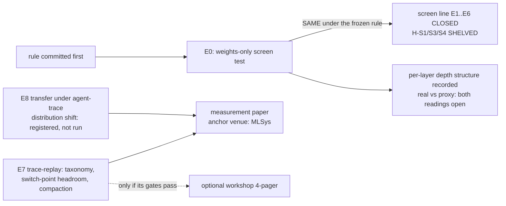
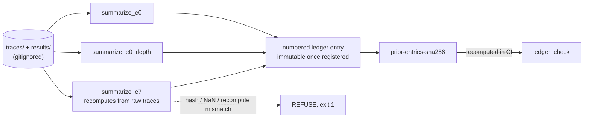
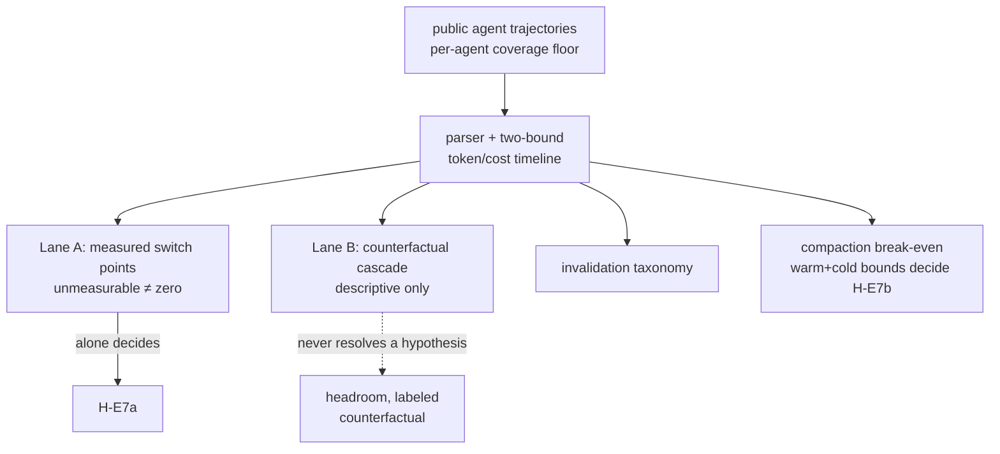
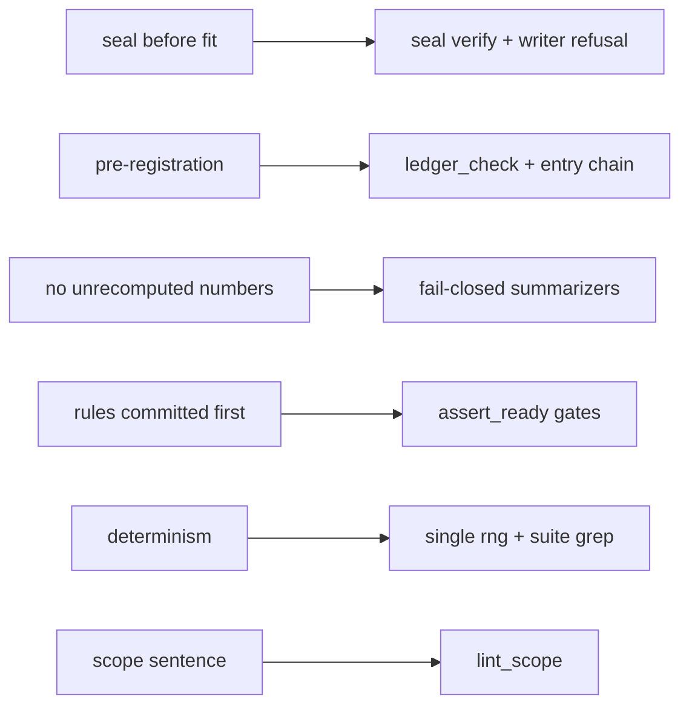
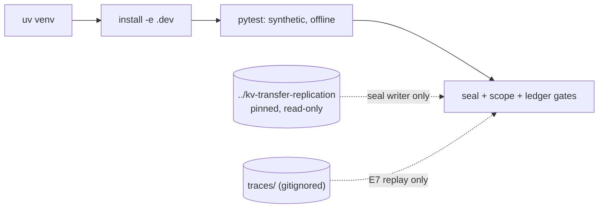
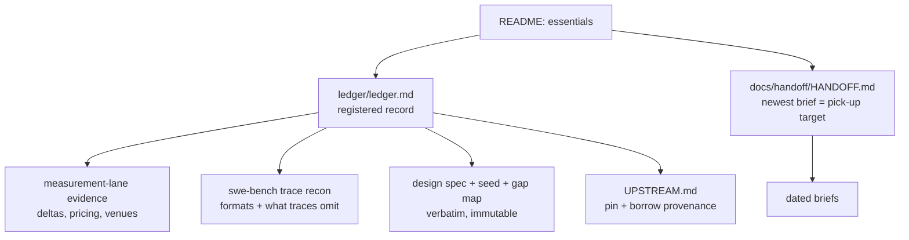

# linear-ceiling

Instruments for pre-registered, auditable experiments on cross-model KV-cache questions.
Two program lines live here: a **sealed pre-fit screen** (E0 ran; ladder verdict **SAME** on a
vocabulary proxy; the line is **closed**, its hypotheses `SHELVED`), and a **trace-replay
measurement program** over agentic KV-cache workloads — registered *and* built, with no
hypothesis decided yet. The ledger is the authority on state; every figure lives there or in
`docs/`, never here.



The scope sentence, held verbatim:

> The screen predicts what a linear mapper can achieve; retention asymmetry beyond that
> prediction is measured and attributed receiver-side, not explained.

## How a number becomes a claim

Nothing enters the ledger by hand. `results/` and `traces/` are gitignored; the only path from
computation to record is a summarizer that **recomputes from the raw inputs and refuses on any
disagreement** — proven by tamper tests, not asserted. Each entry then hash-chains the
registered text above it.



## The E7 measurement program

Three outputs on public agent traces at pinned provider pricing: an invalidation taxonomy with
event frequencies, transfer headroom at model-switch points in dollars, and the compaction
break-even distribution. The instrument is built — adapters, a two-bound cost model, both
lanes, a commit gate, and a fail-closed summarizer. Its thresholds, lanes, cost-model
parameters and gates are registered; **no hypothesis is decided yet**, and the per-agent
coverage floor is not met on one suite alone.



Token counts are exact where a public encoder exists and calibrated per content type
otherwise, because the crude estimator is differentially biased across prose and JSON — the
measured basis is in the ledger.

## Hard invariants, and what enforces each

1. **Seal before fit** — the seal writer refuses if a fitted mapper exists; CI's `seal verify`
   proves hash integrity and commit immutability only, never the pre-fit ordering itself
   (that is proved by the writer's refusal, on a machine that sees the upstream).
2. **Pre-registration** — verdicts stated against the rule as written; amendments are new
   numbered entries; the entry chain makes silent edits to registered text fail CI. The
   header/table above `## Entries` are editable commentary outside the chain, and a history
   rewrite that regenerates chain or seal is locally undetectable.
3. **No unrecomputed numbers** — summarizers only, fail-closed, tamper-tested.
4. **Experiments refuse until their rules are committed** — the E0 and E7 runners read no data
   until the registering entries and their config are committed and unmodified.
5. **Determinism** — one seeded generator (`rng.make_rng`); the suite greps for any other.
6. **Scope sentence verbatim, once, in this README** — `lint_scope`.



## Setup

```bash
uv venv --python 3.12 .venv
uv pip install torch --index-url https://download.pytorch.org/whl/cpu
uv pip install -e ".[dev]"
pytest
python -m linear_ceiling.seal verify && python -m linear_ceiling.lint_scope && python -m linear_ceiling.ledger_check
```

The suite runs offline in seconds on synthetic fixtures; a green suite proves the tooling, not
any result. The seal writer additionally needs the upstream checked out at
`../kv-transfer-replication` (read-only, pinned — `UPSTREAM.md`; it fails closed if missing).
E7 additionally needs trajectories under `traces/`, which are acquired locally and never
committed.



## Docs map

| path | role |
|---|---|
| `ledger/ledger.md` | the registered record: hypotheses, verdicts, numbered immutable entries — **start here for program state** |
| `docs/handoff/HANDOFF.md` | handoff index; the newest brief is the pick-up target |
| `docs/2026-08-26-kv-handoff-screen-design.md` | design spec, verbatim (authority on the original scope; superseded where entries say so) |
| `docs/2026-08-26-seed-w1.md` · `docs/gap-map.md` | W1 seed and E7 gap map, verbatim |
| `docs/2026-09-01-measurement-lane-evidence.md` | why the program re-scoped: paper deltas, pricing pins, venue facts |
| `docs/2026-09-01-swe-bench-trace-recon.md` | trajectory availability, formats, and what they do and do not record |
| `UPSTREAM.md` | the pinned upstream and the provenance ledger for everything borrowed |
| `ledger/predictions/` | sealed per-pair predictions (empty until something is sealed pre-fit) |
| `CLAUDE.md` | repo brief for agent sessions: commands, layout, binding rules |



Status tags used in the ledger: `[VALIDATED]` ran and survived refutation · `[BASELINE]` ran,
numbers in the ledger · `[STRETCH]` designed, not run · `[FUTURE]` not designed ·
`[SUPERSEDED]`.
