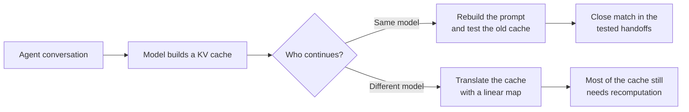

# linear-ceiling

Can one AI model reuse work another model has already done?

When a language model reads a prompt, it builds a **KV cache**: an internal record that saves it
from processing the same text again. Reusing that cache could reduce latency and cost. This
project tests when reuse is possible in real agent conversations, both when the same model
continues the work and when a different model takes over.



## Contents

- [What the experiments found](#what-the-experiments-found)
- [How the record stays auditable](#how-the-record-stays-auditable)
- [Where the data lives](#where-the-data-lives) — the three public Hugging Face datasets, including the long-context run
- [Where to go next](#where-to-go-next)
- [Setup](#setup)

## What the experiments found

- **Same-model reuse survived the tested handoffs.** For the 25 shorter handoffs that fit the
  model's native context limit, the old and rebuilt caches were within the registered tolerance at
  every matched token (entry 0029). The same held for the 35 longer handoffs, 35K to 80K tokens,
  once the model's context window was extended to reach them (entry 0036), though with much less
  room to spare: deviation grows several-fold for tokens that sat beyond the native window. This is
  an ideal lower bound, not a working cache-reuse system.
- **A simple cross-model translation was not useful.** A linear map trained on generic text lost
  accuracy on agent text. At the handoff, an ideal selector still needed to recompute a median of
  92.86% of matched tokens on the shorter handoffs and 96.40% on the longer ones. Entries 0029 and
  0036 record the results.
- **Public traces cannot answer the whole cost question.** Model switches were rare in the 2,904
  public trajectories studied, and the traces omit some information needed for full cache
  accounting. The reported cost figures are bounds, not production estimates.

The practical result is narrow: a cache-aware router should first ask whether the same model will
continue. These experiments do not show that a linear map makes caches portable between models.

The current objective, every decided cell with its entry, what the positive verdict does and does
not mean, and what comes after the paper: `ledger/ledger.md` (the hypothesis table, then the
entries its cells cite) and `docs/paper/2026-09-10-lcfm-outline-v2.md`. A consolidated
`docs/status.md` is referenced in earlier drafts and has not been written; the archived form is
`docs/archive/README-2026-09-09-status.md`.

## How the record stays auditable

The repository treats each result like a registered experiment, not an editable report.

1. The research rule and thresholds are committed before a run starts.
2. A summarizer recalculates each reported number from the raw output and stops on a mismatch.
3. The numbered ledger entries are hash-chained and checked in CI, so later edits fail the build.

`ledger/ledger.md` is the source of truth for hypotheses, rules, results, and verdicts. A green test
suite proves that the tools work. It does not prove a scientific claim.

The original scope boundary remains fixed:

> The screen predicts what a linear mapper can achieve; retention asymmetry beyond that
> prediction is measured and attributed receiver-side, not explained.

## Where the data lives

Raw model outputs never enter git history. Each GPU run's tensors are backed up to a
Hugging Face dataset after the run is verified at home; the backup is transport, not evidence, and
every file is checked in both directions before it counts.

| dataset | what it holds |
|---|---|
| [`hossainpazooki/linear-ceiling-e9-2026-09-04`](https://huggingface.co/datasets/hossainpazooki/linear-ceiling-e9-2026-09-04) | the same-model handoff experiment on the 25 shorter handoffs (entries 0026–0029) |
| [`hossainpazooki/linear-ceiling-n420-2026-09-08`](https://huggingface.co/datasets/hossainpazooki/linear-ceiling-n420-2026-09-08) | the larger calibration set behind the cross-model map's sensitivity check (entries 0033–0034) |
| [`hossainpazooki/linear-ceiling-e9l-2026-09-10`](https://huggingface.co/datasets/hossainpazooki/linear-ceiling-e9l-2026-09-10) | the long-context run on the 35 longer handoffs (entries 0035–0036) |

All three datasets are public as of 2026-09-11 (`private: false`, `gated: false` from the Hub API);
no read token is needed to fetch them. Protocol R8 still specifies a **private** dataset — that
divergence is unreconciled and is the operator's to rule on. Restore and verify: R8 in
`docs/gpu-experiment-protocol.md`, checked by `tools/hf_verify_backup.py <repo_id> <local_root>`.

## Where to go next

| if you want to | read |
|---|---|
| see every hypothesis, rule, result and verdict | `ledger/ledger.md` — the table, then the entries its cells cite |
| understand why the program asked these questions | `docs/gap-map.md` and `docs/2026-09-06-gap-map-revisited.md` |
| read the paper being written from this record | `docs/paper/2026-09-10-lcfm-outline-v2.md` |
| pick up the work | `docs/handoff/HANDOFF.md`, newest brief first |
| run or re-run an experiment | `CLAUDE.md` for the commands, `docs/gpu-experiment-protocol.md` for the rules |
| see what went wrong before and how it was caught | `docs/learnings/LEARNINGS.md` |
| see the older, diagram-heavy README | `docs/archive/` |

## Setup

```bash
uv venv --python 3.12 .venv
uv pip install torch --index-url https://download.pytorch.org/whl/cpu
uv pip install -e ".[dev]"
pytest
python -m linear_ceiling.seal verify && python -m linear_ceiling.lint_scope && python -m linear_ceiling.ledger_check
```

The suite runs offline on synthetic fixtures. The experiments need local data that is not in the
repository: public agent trajectories under `traces/` (rebuilt from `config/e7-manifest.json`) and
the pinned upstream repository named in `UPSTREAM.md`, which every experiment invokes by subprocess
and refuses to run against if its pin does not hold.
