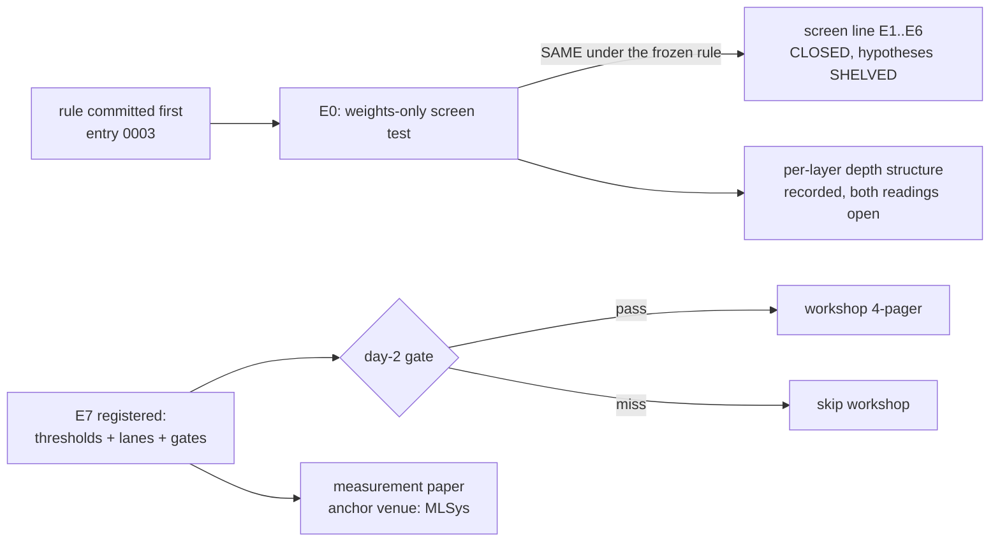
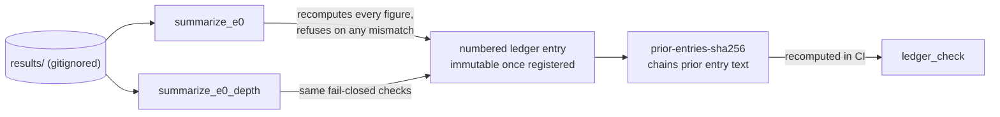
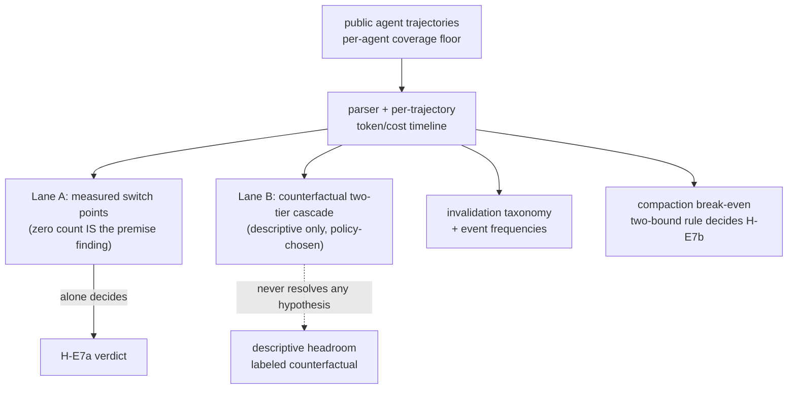
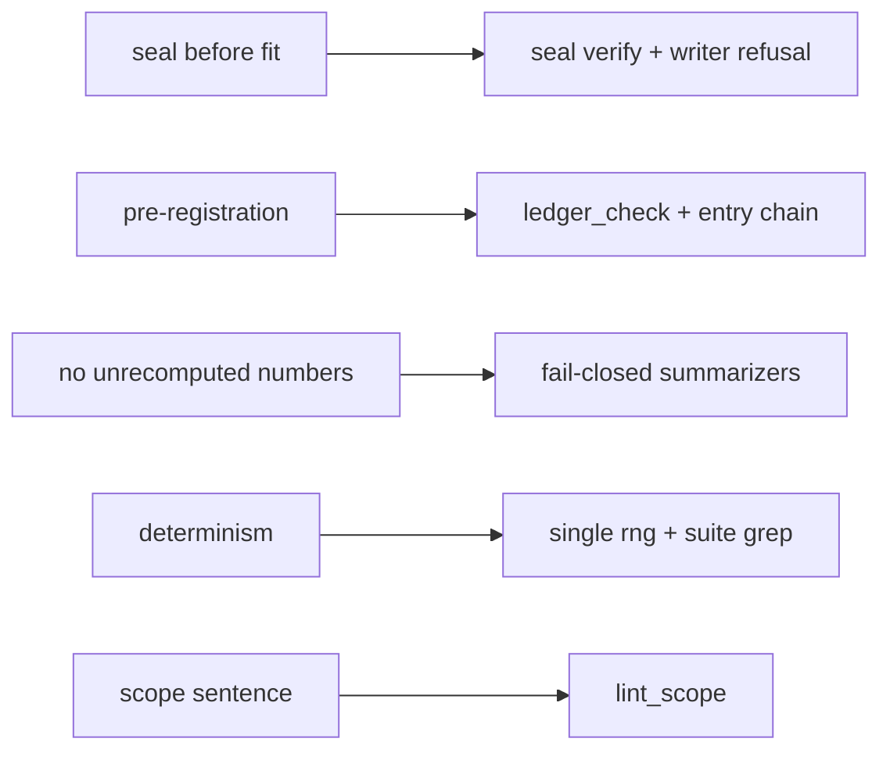
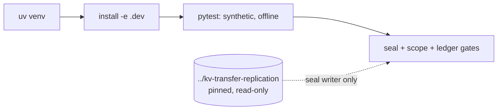
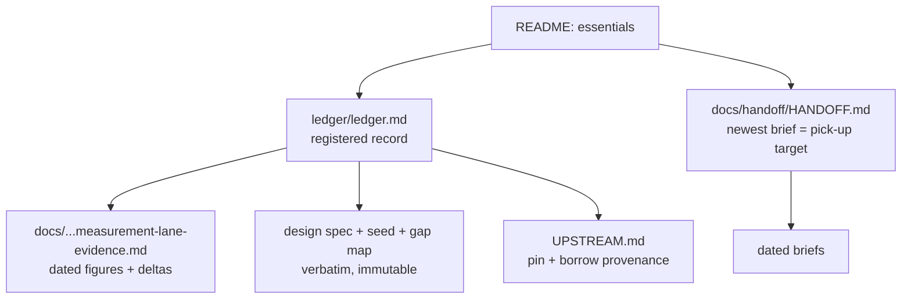

# linear-ceiling

Instruments for pre-registered, auditable experiments on cross-model KV-cache questions.
Two program lines live here: a **sealed pre-fit screen** (E0 ran; ladder verdict **SAME** on a
vocabulary proxy; the line is **closed** — entries 0004/0006), and a **trace-replay
measurement program** over agentic KV-cache workloads (**registered, not built** — entries
0006/0007 hold its thresholds, lanes, and gates). Every claim's evidence lives in the ledger
and `docs/`, not here.



The scope sentence, held verbatim:

> The screen predicts what a linear mapper can achieve; retention asymmetry beyond that
> prediction is measured and attributed receiver-side, not explained.

## How a number becomes a claim

Nothing enters the ledger by hand. `results/` is gitignored; the only path from computation
to record is a fail-closed summarizer, and from entry 0007 on every entry hash-chains the
registered text above it.



## The E7 measurement program (registered, not built)

Three outputs on public agent traces at pinned provider pricing: an invalidation taxonomy
with event frequencies, transfer headroom at model-switch points in dollars, and the
compaction break-even distribution. Two lanes, never merged; no parser, replay, or cost-model
code exists yet. Entries 0006 + 0007 are the authority — read both before writing any E7 code.



## Hard invariants, and what enforces each

1. **Seal before fit** — the seal writer refuses if a fitted mapper exists; CI's `seal verify`
   proves hash integrity and commit immutability only, never the pre-fit ordering itself
   (that is proved by the writer's refusal, on a machine that sees the upstream).
2. **Pre-registration** — verdicts stated against the rule as written; amendments are new
   numbered entries; the entry chain makes silent edits to registered text fail CI. The
   header/table above `## Entries` are editable commentary outside the chain, and a history
   rewrite that regenerates chain or seal is locally undetectable.
3. **No unrecomputed numbers** — summarizers only, fail-closed.
4. **Determinism** — one seeded generator (`rng.make_rng`); the suite greps for any other.
5. **Scope sentence verbatim, once, in this README** — `lint_scope`.



## Setup

```bash
uv venv --python 3.12 .venv
uv pip install torch --index-url https://download.pytorch.org/whl/cpu
uv pip install -e ".[dev]"
pytest
python -m linear_ceiling.seal verify && python -m linear_ceiling.lint_scope && python -m linear_ceiling.ledger_check
```

The suite runs offline in seconds on synthetic matrices; a green suite proves the tooling,
not any result. The seal writer additionally needs the upstream checked out at
`../kv-transfer-replication` (read-only, pinned — `UPSTREAM.md`; it fails closed if missing).



## Docs map

| path | role |
|---|---|
| `ledger/ledger.md` | the registered record: hypotheses, verdicts, numbered immutable entries — start here for program state |
| `docs/2026-08-26-kv-handoff-screen-design.md` | design spec, verbatim (authority on the original scope; superseded where entries say so) |
| `docs/2026-08-26-seed-w1.md` · `docs/gap-map.md` | W1 seed and E7 gap map, verbatim |
| `docs/2026-09-01-measurement-lane-evidence.md` | evidence behind the re-scope: paper deltas, trace probe, pricing pins, venue facts — all dated figures live here |
| `docs/handoff/HANDOFF.md` | handoff index; newest brief is the pick-up target |
| `UPSTREAM.md` | the pinned upstream and the provenance ledger for everything borrowed |
| `ledger/predictions/` | sealed per-pair predictions (empty until something is sealed pre-fit) |
| `CLAUDE.md` | repo brief for agent sessions: commands, layout, binding rules |



Status tags used in the ledger: `[VALIDATED]` ran and survived refutation · `[BASELINE]` ran,
numbers in the ledger · `[STRETCH]` designed, not run · `[FUTURE]` not designed ·
`[SUPERSEDED]`.
