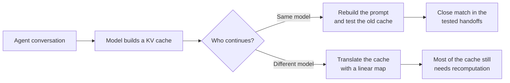

# linear-ceiling

Can one AI model reuse work another model has already done?

When a language model reads a prompt, it builds a **KV cache**: an internal record that saves it
from processing the same text again. Reusing that cache could reduce latency and cost. This
project tests when reuse is possible in real agent conversations, both when the same model
continues the work and when a different model takes over.



## What the experiments found

- **Same-model reuse survived the tested handoffs.** For the 25 shorter handoffs that fit the
  experiment's context limit, the old and rebuilt caches were within the registered tolerance.
  This is an ideal lower bound, not a working cache-reuse system.
- **A simple cross-model translation was not useful.** A linear map trained on generic text lost
  accuracy on agent text. At the handoff, an ideal selector still needed to recompute a median of
  92.86% of matched tokens. Entry 0029 records the result.
- **Public traces cannot answer the whole cost question.** Model switches were rare in the 2,904
  public trajectories studied, and the traces omit some information needed for full cache
  accounting. The reported cost figures are bounds, not production estimates.

The practical result is narrow: a cache-aware router should first ask whether the same model will
continue. These experiments do not show that a linear map makes caches portable between models.

## How the record stays auditable

The repository treats each result like a registered experiment, not an editable report.

1. The research rule and thresholds are committed before a run starts.
2. A summarizer recalculates each reported number from the raw output and stops on a mismatch.
3. The numbered ledger entries are hash-chained and checked in CI, so later edits fail the build.

`ledger/ledger.md` is the source of truth for hypotheses, rules, results, and verdicts. A green test
suite proves that the tools work. It does not prove a scientific claim.

The original scope boundary remains fixed:

> The screen predicts what a linear mapper can achieve; retention asymmetry beyond that
> prediction is measured and attributed receiver-side, not explained.

## Research direction

- **LCFM at NeurIPS 2026:** a four-page paper about what public agent traces can and cannot show.
  The outline is in `docs/paper/2026-09-06-lcfm-outline.md`.
- **MLSys 2027:** the longer measurement paper and main publication target.
- **E-RL:** a future test of cache reuse between reinforcement-learning checkpoints. It is a
  design only; no experiment is registered yet.

The next proposed experiments cover longer handoffs and a new corpus that records the fields
missing from public traces.

## Read the technical record

- [What `HELD` means](#what-held-means-here) explains the positive same-model result and its limits.
- [Status](#status) connects the E7, E8, and E9 experiments to their ledger entries.
- [Setup](#setup) runs the offline test suite and repository checks.
- [Backups](#backups-hugging-face) documents how private GPU artifacts are stored and verified.
- [Docs map](#docs-map) points to the ledger, paper outline, runbooks, and research history.

## What HELD means here

H-E9 is the one positive cell, and its verdict word carries a narrow, registered meaning.

- **The claim.** At a real re-rendered handoff (the receiver rebuilds the prompt from the sender's
  content), the receiver's own KV at the new positions agrees with its KV at the original positions
  closely enough to be reused. Same model on both sides; this is not a cross-model claim.
- **The statistic (0023).** Per matched token, the centered deviation between the two KV states in
  the units of the mapper's R². A token "needs recompute" when its deviation exceeds τ_K, which is
  set to the k = 1 cross-model mapper's own held-out shortfall on generic text: "no worse than the
  mapper itself" is the tolerance. f* is the fraction of matched tokens an oracle would have to
  recompute; the verdict is the median f* over included handoffs. HOLDS ≤ 0.15 (CacheBlend's
  achieved recompute budget), DEGRADES ≥ 0.50, UNRESOLVED between. Band frozen before any prefill.
- **The result (0029).** f* = 0 on every matched token of every included handoff: not one token
  exceeds the tolerance. The τ ladder (0025) shows this is not vacuous, since a much tighter τ does
  produce recompute. Identity, prefix-invariance and null controls passed.
- **Read on a floor (0027).** f* assumes an oracle that knows which tokens deviate and recomputes
  them in isolation. It is a lower bound on what any real scheme would recompute, not a scheme. HELD
  says "no more than the mapper, on a floor"; it does not say a system achieves this.
- **Scope.** One pair (Qwen3-0.6B → 1.7B, receiver 1.7B), one direction, one agent family, and the
  25 of 68 observed handoffs whose sender prompt fits the 32,768-token cap, which is the shorter half
  by length; the excluded 43 are counted and compared on length beside every E9 figure (0025). Nothing is claimed about handoffs longer
  than the cap (`docs/2026-09-08-seed-e9-long-half.md` is the unregistered successor).
- **The cross arm beside it, descriptive.** The same tokens pushed through the fitted cross-model
  mapper sit beyond DEGRADES, and stay there under the larger-calibration mapper of 0034. For the
  gap map's routing question this is the finding: what a cache-aware router needs to know at a
  boundary is the binary "same model or not", not a transfer quantity.
- **What HELD does not move.** H-E7a's headroom verdict (switches are rare and the recoverable
  spend immaterial on the public record), H-E8 (the linear map fails on agent text), and the
  recording-gap reading. HELD says same-model reuse across a re-render is free at the floor; it does
  not say there is much of it to collect on public traces.

## Status

| hypothesis | verdict | entries |
|---|---|---|
| H-E7a — switch-point headroom is material on public agent traces | **NOT CONFIRMED** (registered reading; request-level reading recorded, ruling: registered) | 0015, 0018, 0022, 0024 |
| H-E7b — compaction break-even has substantial negative mass | **UNESTIMABLE** | 0015 |
| H-E8 — the fitted cross-model map survives agent-text content shift | **NOT CONFIRMED** | 0020 |
| H-E9 — KV agreement at a real re-rendered handoff keeps its usefulness | **HELD**, read on a floor; cross arm beyond DEGRADES (descriptive) | 0029 (0023, 0025, 0027) |
| H-S1…H-S4 (pre-fit screen line) | `SHELVED` / H-S2 first clause `NOT CONFIRMED` | 0003–0006 |

**How the cells hold each other up.** H-E9 is the result; it does not stand alone, and the two
cells beside it are not optional context.

- **E7 supplies the event.** The 68 handoffs E9 scores are the switch points E7 found on the
  public record (0015, 0018), and E7's finding that none of the 68 hands the receiver a
  byte-identical prefix is what makes "re-rendered" an observed event rather than a construction
  of the experiment. Without E7, E9 would be scoring a handoff nobody has seen. In the paper, E7
  is therefore the corpus section: where the handoffs come from, what a real re-render looks
  like, and why the headroom they carry is small (0018). It is not a second results section.
- **E8 explains the contrast.** E9's cross-model arm sits beyond DEGRADES, and that number is
  unexplained on its own. E8 is the explanation: the linear map was fit on generic text and does
  not hold on agent text (0020, 0031), so pushing agent KV through it at a handoff fails for the
  same reason it fails at rest. 0034 closes the obvious objection, since the failure survives an
  eight-times-larger calibration and the cross arm stays beyond DEGRADES under the larger mapper.
  Without E8, a reader could attribute the cross-arm number to the handoff; with it, the
  attribution is to the map.

So the paper's claim reads: at a real re-rendered agent handoff, same-model KV is reusable at
zero recompute on an oracle floor, and a linear cross-model map is not. E7 makes the first
clause about something real, E8 makes the second clause a finding rather than a number.

A verdict cell is decided once, under the rule registered before its run, and only a numbered
entry with a `verdict:` line can change it. Everything after 0029 is **descriptive**: a
registration, an admission, or a measurement that stands beside a decided cell without
re-deciding it. Descriptive does not mean minor. Two of these entries re-ran the mechanism
experiments under different protocols to ask whether the cells were artifacts of the original
choices, and one of them found a band word that moved under the larger calibration. The cell
did not move, because the rule says it cannot; the paper says both.

| entry | kind | what it did | effect on cells |
|---|---|---|---|
| 0030 | registration | E8 amended before any rescoring: arm (b) over every agent sequence instead of a held-out tail, per-sequence moments, a seeded bootstrap of the drop; upstream re-pinned | none |
| 0031 | figures | the amended E8 run through its summarizer; same band words as 0020 at k = 1 | none |
| 0032 | admission | E9 allowed into the LCFM 4-pager behind its summarizer gate, with the co-author refutation as a stated condition | none |
| 0033 | registration | calibration-size sensitivity: the k = 1 mapper refit on n = 420 sequences (eight times 0009's), E8 arms and the E9 kept-subset cross arm to be re-scored; registered before the fit existed, provenance of both dump halves stated | none |
| 0034 | figures | the n = 420 mapper's run through both summarizers. E8 at k = 1: K stays in the dead band, **V's drop falls to the DEGRADES edge and reads UNRESOLVED**, where the n = 50 mapper read DEGRADES. E9 cross arm: closer to the same-model floor than under the n = 50 mapper, still beyond DEGRADES | none; H-E8 was decided by 0020 under the registered protocol |

The 0034 V result is the one a reader should carry: the E8 sentence "does not survive content
shift" is calibration-sensitive on the V read-out and dead-band on K at both calibrations. The
4-pager states the E8 result at its registered calibration and reports 0034 beside it.

**Now:** freeze → the 4-pager.
Newest brief: `docs/handoff/HANDOFF.md`.

## Setup

```bash
uv venv --python 3.12 .venv
uv pip install torch --index-url https://download.pytorch.org/whl/cpu
uv pip install -e ".[dev]"
pytest
python -m linear_ceiling.seal verify && python -m linear_ceiling.lint_scope && python -m linear_ceiling.ledger_check
```

The suite runs offline on synthetic fixtures; green proves the tooling, not a result. E7 needs
trajectories under `traces/` (local, never committed; rebuilt from `config/e7-manifest.json`);
E8 and E9 invoke the pinned upstream (`UPSTREAM.md`) by subprocess and refuse if its pin does
not hold. Commands per experiment: `CLAUDE.md`.

## Backups (Hugging Face)

`results/`, `data/` and `traces/` never enter git history, so the only off-machine copy of a
GPU run's tensors is a **private Hugging Face dataset**, pushed from the verified home mirror
after every sitting (protocol R8 in `docs/gpu-experiment-protocol.md`). Three rules bound it:

- **Transport, not evidence.** A summarizer reads the local mirror only; nothing on the Hub is a
  ledger figure, and a refusal at home is a finding, never something a re-download works around.
- **Every file verified in both directions.** Each LFS file's `lfs.sha256` must equal the local
  sha256; each non-LFS file is downloaded and hashed; every local file must be on the Hub and
  vice versa. `tools/hf_verify_backup.py <repo_id> <local_root>` is that check and exits 0 only
  when all of it holds.
- **Tokens are scoped, expiring, and live only in the environment.** Write tokens for the pusher,
  read tokens for collaborators; a token pasted anywhere is revoked. A private user-namespace
  dataset cannot be shared per user, so a collaborator gets a read token.

| dataset | holds | layout at the dataset root |
|---|---|---|
| `hossainpazooki/linear-ceiling-e9-2026-09-04` | the E9 record (entries 0026–0029): `report.json`, `align/`, `controls/`, `scores/`, `tokens/`, box logs, and the kept full dumps | `results/e9/` as in this repo, plus the fitted mapper `mappers/qwen3-0.6b-to-1.7b/k1.*` in the upstream's layout |
| `hossainpazooki/linear-ceiling-n420-2026-09-08` | the n = 420 calibration pair behind entries 0033/0034, the tagged mapper and its `r2.json`, the sitting's box logs and sha manifests | the upstream's own layout: `data/kv/qwen3-0.6b-to-1.7b-n420/`, `mappers/qwen3-0.6b-to-1.7b/n420/`, `results/mapper/qwen3-0.6b-to-1.7b/n420/` |

Restore, with a read token in `HF_TOKEN`:

```bash
# E9: results/ lands in this repo, the mapper in the upstream checkout
hf download hossainpazooki/linear-ceiling-e9-2026-09-04 --repo-type dataset --local-dir /tmp/e9-restore
cp -r /tmp/e9-restore/results/e9 results/ && cp -r /tmp/e9-restore/mappers ../kv-transfer-replication/
python tools/hf_verify_backup.py hossainpazooki/linear-ceiling-e9-2026-09-04 /tmp/e9-restore

# n = 420 pair: upstream layout, so it lands directly in the upstream checkout
hf download hossainpazooki/linear-ceiling-n420-2026-09-08 --repo-type dataset --local-dir ../kv-transfer-replication
python tools/hf_verify_backup.py hossainpazooki/linear-ceiling-n420-2026-09-08 ../kv-transfer-replication
```

After a restore the gates decide, not the download: `e9 --check`, `e8 --check --config config/e8c.toml`
and `e9_rescore check --config config/e9c.toml` must print ready before any summarizer runs.
Large pushes use `hf upload-large-folder --num-workers 1` on Windows (multi-worker uploads
stall); the dataset card goes last.

## Docs map

| path | role |
|---|---|
| `ledger/ledger.md` | the registered record: hypotheses, verdicts, numbered immutable entries — **start here** |
| `docs/handoff/HANDOFF.md` | handoff index; the newest brief is the pick-up target |
| `docs/learnings/LEARNINGS.md` | non-obvious findings, one per entry, each with a `re-verify:` line |
| `docs/paper/2026-09-06-lcfm-outline.md` | the LCFM 4-pager outline: every figure with its entry and freeze status |
| `docs/2026-09-06-gap-map-revisited.md` | the 2026-08-26 gap map read against the ledger: each claim with its verdict |
| `docs/gap-map.md` · `docs/2026-08-26-seed-w1.md` · `docs/2026-08-26-kv-handoff-screen-design.md` | the original motivation, seed and design spec, verbatim and immutable |
| `docs/background.md` | program history and vocabulary |
| `docs/2026-09-01-measurement-lane-evidence.md` | why the program re-scoped: paper deltas, pricing pins, venue facts |
| `docs/2026-09-01-swe-bench-trace-recon.md` | trace formats and what they do and do not record |
| `docs/2026-09-02-e9-gpu-runbook.md` · `docs/2026-09-08-n420-target-dump-runbook.md` · `docs/gpu-experiment-protocol.md` | the two GPU sittings; standing rules R1–R12 |
| `tools/jupyterhub/` · `tools/hf_verify_backup.py` | the JupyterHub box driver and pull loop; the two-direction backup verifier |
| `docs/2026-09-08-seed-e9-long-half.md` | seed for E9 on the long half of the handoffs, unregistered; needs a 3g.40gb slice or a full card |
| `docs/2026-09-02-e-rl-design.md` | E-RL design, unregistered |
| `docs/drafts/` | append scripts for entries not yet written; the README there is the only number allocator |
| `UPSTREAM.md` | the pinned upstream and the provenance ledger for everything borrowed |
