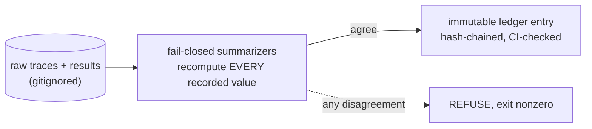

# linear-ceiling

A pre-registered measurement program on **cross-model KV-cache economics over public agent
traces** — do the events that motivate cross-model cache transfer (mid-trajectory model
switches, compaction) actually occur in real agent workloads, how often, and what would
transfer be worth where they do? Every hypothesis was registered with its decision rule before
its experiment ran; every number on the record was recomputed from raw inputs by a fail-closed
summarizer; the ledger is immutable by hash chain. An earlier program line (a sealed pre-fit
screen for transfer fidelity) ran, returned its verdict, and was closed; its record stands in
the same ledger.

The scope sentence, held verbatim:

> The screen predicts what a linear mapper can achieve; retention asymmetry beyond that
> prediction is measured and attributed receiver-side, not explained.

## Findings at a glance

Verdicts only — every figure lives in the named ledger entry, never here.

| hypothesis | verdict | what it says | entries |
|---|---|---|---|
| H-E7a — switch-point headroom is material on public agent traces | **NOT CONFIRMED** | Mid-trajectory switching exists (one designed critic/selector family, always re-rendered, never byte-identical), but its recoverable prefill sits an order of magnitude under the registered cutoff; the motivating story reverts to fleet mixing. | 0006, 0010, 0013–0018 |
| H-E7b — compaction break-even has substantial negative mass | **UNESTIMABLE** | Zero compaction events on every trajectory that can evidence one; final-transcript traces structurally cannot show it. | 0014, 0015 |
| H-E8 — the fitted cross-model map survives agent-trace content shift | **NOT CONFIRMED** | The value pathway drops outside the registered band on agent text even with no switch and no position change; the key pathway lands in the dead zone. | 0009, 0016, 0020 |
| H-E9 — KV agreement at a real re-rendered handoff keeps its usefulness | *unresolved* — registered, gated, awaiting the GPU run | Turns the headroom **upper bound** into an observed ceiling. | 0019 |
| H-S1…H-S4 (pre-fit line) | `SHELVED` / `NOT CONFIRMED` (H-S2 first clause) | The weights-only test returned SAME under a rule frozen in advance; that line is closed. | 0003–0006 |

Alongside the verdicts, the record carries an **invalidation taxonomy** with a per-class
NOT-MEASURABLE state (most cells of public traces cannot evidence most cache-death causes —
that is the finding, not a tooling gap) and a **hidden-prefix result**: provider-reported
usage shows agent requests bill a fixed block the traces never record, so every trace-only
cost figure anywhere is a lower bound (entries 0012, 0014, 0015).

## Verify, don't trust

```bash
uv venv --python 3.12 .venv
uv pip install torch --index-url https://download.pytorch.org/whl/cpu
uv pip install -e ".[dev]"
pytest                                                  # offline, synthetic fixtures, seconds
python -m linear_ceiling.seal verify && python -m linear_ceiling.lint_scope && python -m linear_ceiling.ledger_check
```

A green suite proves the tooling, not any result. The results are verified differently: each
`summarize_*` module walks the **raw inputs** again, recomputes every recorded value, and
refuses on any disagreement — and the suite's tamper tests prove the refusals fire. Replaying
E7 end-to-end additionally needs trajectories under `traces/` (gitignored, acquired locally;
`docs/2026-09-01-swe-bench-trace-recon.md` says where they live); the seal writer additionally
needs the pinned upstream at `../kv-transfer-replication` (`UPSTREAM.md`).



## Where to look, in order

| path | role |
|---|---|
| `ledger/ledger.md` | **start here** — hypotheses, decision rules, verdicts, and every registered number, in immutable numbered entries |
| `docs/background.md` | how a number becomes a claim: the refusal layers, the invariants and their enforcement, what happens when the instrument itself is wrong, vocabulary |
| `docs/handoff/HANDOFF.md` | session-by-session state; the newest brief is the pick-up target |
| `docs/learnings/LEARNINGS.md` | non-obvious findings, one per entry, each with a read-only `re-verify:` line |
| `docs/2026-09-01-measurement-lane-evidence.md` | why this program: paper deltas, pricing pins, venue facts |
| `docs/2026-09-01-swe-bench-trace-recon.md` | trace availability, formats, and what they do and do not record |
| `docs/2026-09-01-lcfm-gpu-plan.md` · `docs/2026-09-02-e9-gpu-runbook.md` | the venue plan and the E9 GPU day |
| `docs/2026-08-26-kv-handoff-screen-design.md` · `docs/2026-08-26-seed-w1.md` · `docs/gap-map.md` | the original design documents, verbatim and immutable |
| `UPSTREAM.md` | the pinned read-only upstream instrument and the provenance of everything borrowed |
| `CLAUDE.md` | repo brief for agent sessions: commands, layout, binding rules |

Layout in one line: `src/linear_ceiling/` holds the instrument (adapters, cost model, lanes,
taxonomy, gates, summarizers), `tests/` mirrors it module-for-module, `config/*.toml` holds
every registered parameter, and nothing under `results/` or `traces/` is ever committed.
