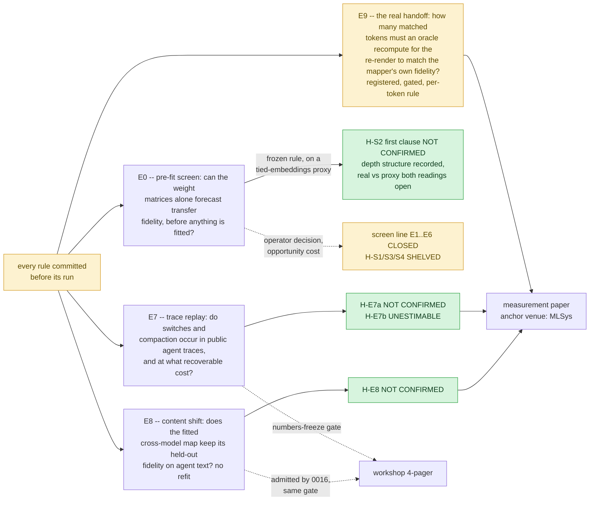
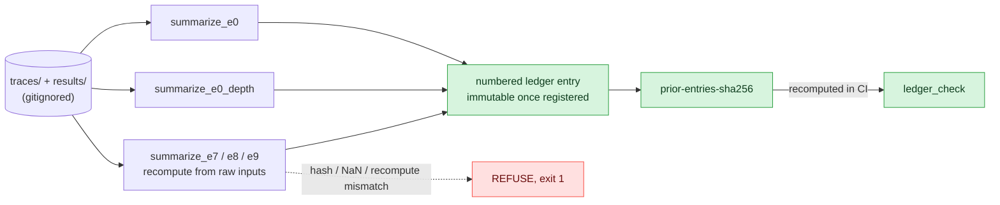
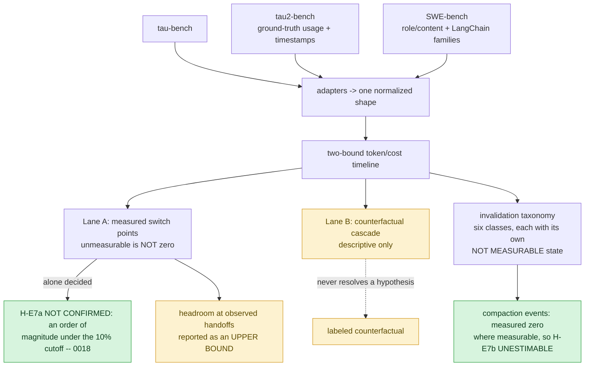
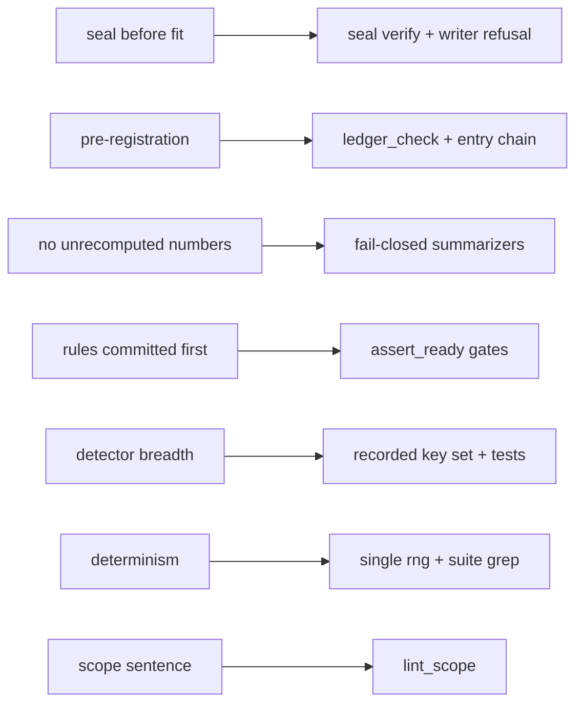
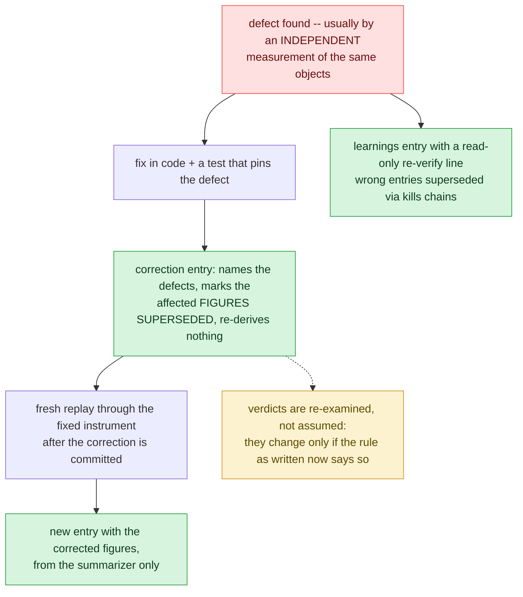
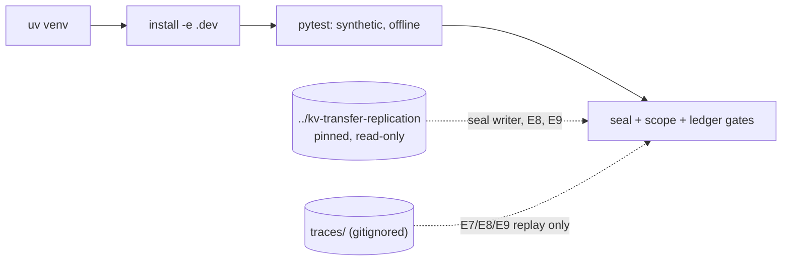
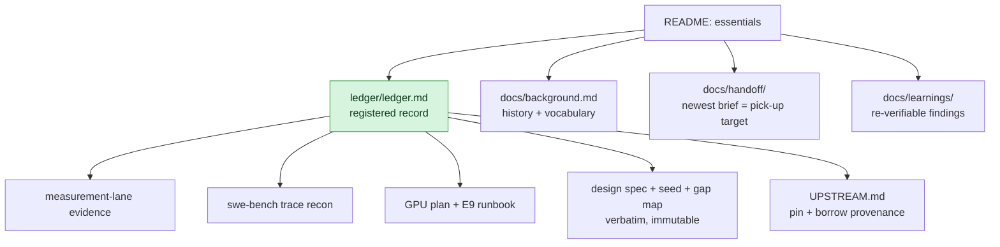

# linear-ceiling

Instruments for pre-registered, auditable experiments on cross-model KV-cache questions.
Two program lines live here: a **pre-fit screen line** (closed by operator decision; its one
decided clause is scoped to a tied-embeddings vocabulary proxy and never generalized —
`docs/background.md`; the other hypotheses are `SHELVED`), and a **trace-replay
measurement program** over agentic KV-cache workloads — registered, built, and replayed across
three public corpora. The premise hypotheses are decided: **H-E7a `NOT CONFIRMED`**
(mid-trajectory switch headroom is **unevidenced in public benchmark traces** — a claim about
the evidence base, not about production workloads, which leave no public trace; per 0015 any
case for cross-model KV transfer must then rest on different models serving different
requests), **H-E7b `UNESTIMABLE`** (no corpus that can evidence compaction shows any), and
**H-E8 `NOT CONFIRMED`** (the fitted cross-model map does not survive agent-trace content
shift within its band). E9 — the achievable fraction at a real re-rendered handoff — is
registered and gated, its rule amended before any prefill (entry 0023: a per-token oracle
selective-recompute fraction replaces pooled R² as the verdict statistic), awaiting its GPU run. The ledger is the authority on state; every figure
lives there or in `docs/`, never here.



The scope sentence, held verbatim:

> The screen predicts what a linear mapper can achieve; retention asymmetry beyond that
> prediction is measured and attributed receiver-side, not explained.

## Findings at a glance

Verdicts only — every figure lives in the named ledger entry, never here.

| hypothesis | verdict | what it says | entries |
|---|---|---|---|
| H-E7a — switch-point headroom is material on public agent traces | **NOT CONFIRMED** | Lane A is measurable on 60 of 2,904 trajectories, all from one system with a designed critic stage (always re-rendered, never byte-identical); under the registered denominator its recoverable prefill sits an order of magnitude under the cutoff. Scope: public *benchmark* trajectories are single-model leaderboard runs by construction, so this decides what the public record evidences, not what production routers, fallbacks and cost tiers do — those leave no public trace. 0015's registered consequence: any case for cross-model KV transfer must rest on different models serving different requests. | 0006, 0010, 0013–0018, 0022 |
| H-E7b — compaction break-even has substantial negative mass | **UNESTIMABLE** | Zero compaction events on every trajectory that can evidence one; final-transcript traces structurally cannot show it. | 0014, 0015 |
| H-E8 — the fitted cross-model map survives agent-trace content shift | **NOT CONFIRMED** | The value pathway drops outside the registered band on agent text even with no switch and no position change; the key pathway lands in the dead zone. | 0009, 0016, 0020 |
| H-E9 — KV agreement at a real re-rendered handoff keeps its usefulness | *unresolved* — registered, gated, rule amended per-token before any prefill, awaiting the GPU run | Turns the headroom **upper bound** into an observed ceiling; decided by how many matched tokens an oracle must recompute to reach the mapper's own fidelity. | 0019, 0023 |
| H-S1…H-S4 (pre-fit line) | `SHELVED` / `NOT CONFIRMED` (H-S2 first clause) | Line closed by operator decision; the one decided clause rests on a tied-embeddings vocabulary proxy and was never generalized (`docs/background.md`). | 0003–0006 |

## How a number becomes a claim

Nothing enters the ledger by hand. `results/` and `traces/` are gitignored; the only path from
computation to record is a summarizer that **recomputes from the raw inputs and refuses on any
disagreement** — proven by tamper tests, not asserted. Each entry then hash-chains the
registered text above it, so editing a registered entry fails CI.

Refusal is layered, and each layer fails closed rather than guessing:

1. **Gates refuse to run** — an experiment reads no data until its registering entries and
   config are committed unmodified (and, where an upstream is invoked, until its pin holds:
   pinned commit an ancestor of HEAD, invoked paths unchanged since, working tree clean there).
   E7 additionally refuses unless the trace tree on disk matches the committed corpus manifest
   (`config/e7-manifest.json`: every file's sha256, its S3 key and ETag for SWE-bench objects,
   and the recovered per-submission selection rule) in both directions and in bytes.
2. **Adapters refuse to guess** — an unknown trace shape, a missing request boundary, or an
   argument type that cannot be priced raises instead of approximating; what no adapter accepts
   is recorded as unparsed, never dropped.
3. **Summarizers refuse to summarize** — config drift, a changed/added/missing input file, any
   disagreement between disk, report and the committed manifest, a NaN, a recorded value the
   recomputation does not reproduce, or a report from an older driver each name their reason
   and exit nonzero.
4. **Measurability refuses the flattering zero** — every class of event carries its own NOT
   MEASURABLE state; a trace that cannot evidence a thing never counts as evidence of its
   absence.



## The measurement program

Three registered outputs on public agent traces at pinned provider pricing — all three now on
the record: an invalidation taxonomy with event frequencies, transfer headroom at model-switch
points, and the compaction break-even distribution (as `UNESTIMABLE`). Adapters cover three
corpora with incompatible formats; the coverage floor (trajectories *and* distinct agents per
suite, over two suites) is met. E8 and E9 extend the same discipline to the transfer question
itself, invoking the pinned upstream instrument by subprocess. E9 is decided per token, not by a
pooled score: each matched token's deviation is its share of unexplained variance in R²'s own
units, the verdict statistic is the oracle fraction of tokens that would have to be recomputed
for the rest to sit at the mapper's own fidelity (a lower bound, stated as one), and the
threshold is calibrated from the archived mapper before any prefill. A pipeline-identity control
halts the run on any nonzero deviation, a seeded null pairing fixes the top of the scale, and the
seam and depth profiles are descriptive outputs registered before data.



Two properties of the corpora shape every figure. Serving-model identity is recorded per step
by only a minority of formats, so most trajectories are **not measurable** for Lane A and are
never counted as zero. And public traces omit the system prompt and tool schemas the provider
billed, so **every cost figure computed from visible messages is a lower bound** — the omitted
block is byte-identical per request, i.e. the most cacheable content there is. Both are
registered; the measured basis is in the ledger.

## Hard invariants, and what enforces each

1. **Seal before fit** — the seal writer refuses if a fitted mapper exists; CI's `seal verify`
   proves hash integrity and commit immutability only, never the pre-fit ordering itself
   (that is proved by the writer's refusal, on a machine that sees the upstream). Built for
   the closed screen line and **never exercised on a real prediction** — E1 never ran, so
   `seal verify` reports "no sealed predictions yet"; it stays in CI as infrastructure, not
   as evidence, and E8/E9 make no pre-fit claims and do not use it (0009, 0019).
2. **Pre-registration** — verdicts stated against the rule as written; amendments are new
   numbered entries. What CI enforces (`ledger_check`): every entry block committed at the
   base of a push or pull request is byte-identical afterwards (so the trailing entry is as
   immutable as the chained ones), each entry's chain hash covers everything above it, and
   every verdict cell equals the value set by the numbered entry that claims it (a frozen
   provenance map through 0022, `verdict: H-XX = <VERDICT>` lines from 0024 on). Residual: a
   squash-merge shows only a PR's net change, and a history rewrite regenerates all three
   checks together — only the public remote's history catches that. The header/table above
   `## Entries` stay editable commentary; their cells are protected by provenance, not by hash.
3. **No unrecomputed numbers** — summarizers only, fail-closed, tamper-tested.
4. **Experiments refuse until their rules are committed** — the E0/E7/E8/E9 runners read no
   data until the registering entries and their config are committed and unmodified.
5. **A narrow detector is a defect, never a null** — a probe that cannot see a thing must not
   report its absence; Lane A records the key set it searched alongside its counts.
6. **Determinism** — one seeded generator (`rng.make_rng`); the suite greps for any other.
7. **Scope sentence verbatim, once, in this README** — `lint_scope`.



## When the instrument is wrong

The discipline above assumes the code can be wrong and is built to survive it. A defect in an
adapter or a measure is handled the same way every time — nothing is edited, nothing deleted:



Two properties make this trustworthy rather than cosmetic. **Figures and verdicts are
superseded separately** — a wrong number does not silently drag a verdict with it, and a
verdict that survives a correction is stated as surviving, with the corrected margin. And **a
summarizer that shares the adapter with the driver proves the arithmetic, not the reading** —
which is why load-bearing claims also get cross-checked against an independent view of the
same object (provider-reported usage, an archived result file, a second tokenization)
whenever one exists. Ledger entry 0017 is this loop executed for real.

## Setup

```bash
uv venv --python 3.12 .venv
uv pip install torch --index-url https://download.pytorch.org/whl/cpu
uv pip install -e ".[dev]"
pytest
python -m linear_ceiling.seal verify && python -m linear_ceiling.lint_scope && python -m linear_ceiling.ledger_check
```

The suite runs offline in seconds on synthetic fixtures; a green suite proves the tooling, not
any result. The seal writer additionally needs the upstream checked out at
`../kv-transfer-replication` (read-only, pinned — `UPSTREAM.md`; it fails closed if missing).
E7 additionally needs trajectories under `traces/`, acquired locally and never committed; E8
and E9 invoke the pinned upstream by subprocess and refuse if its pin does not hold.



## Docs map

| path | role |
|---|---|
| `ledger/ledger.md` | the registered record: hypotheses, verdicts, numbered immutable entries — **start here for program state** |
| `docs/background.md` | program history and vocabulary for a first-time reader |
| `docs/handoff/HANDOFF.md` | handoff index; the newest brief is the pick-up target |
| `docs/learnings/LEARNINGS.md` | non-obvious findings, one per entry, each with a read-only `re-verify:` line |
| `docs/2026-08-26-kv-handoff-screen-design.md` | design spec, verbatim (authority on the original scope; superseded where entries say so) |
| `docs/2026-08-26-seed-w1.md` · `docs/gap-map.md` | W1 seed and E7 gap map, verbatim |
| `docs/2026-09-01-measurement-lane-evidence.md` | why the program re-scoped: paper deltas, pricing pins, venue facts |
| `docs/2026-09-01-swe-bench-trace-recon.md` | trajectory availability, formats, and what they do and do not record |
| `docs/2026-09-01-lcfm-gpu-plan.md` | the LCFM sprint plan with GPU runs: what runs on CPU (E8), what needs the A100 (E9) |
| `docs/2026-09-02-e9-gpu-runbook.md` | the E9 GPU day, step by step: pin, environments, run, sync-before-expiry, CPU fallback |
| `UPSTREAM.md` | the pinned upstream and the provenance ledger for everything borrowed |
| `CLAUDE.md` | repo brief for agent sessions: commands, layout, binding rules |



Status tags used in the ledger: `[VALIDATED]` ran and survived refutation · `[BASELINE]` ran,
numbers in the ledger · `[STRETCH]` designed, not run · `[FUTURE]` not designed ·
`[SUPERSEDED]`. Verdicts: `unresolved` · `HELD` · `NOT CONFIRMED` · `WITHDRAWN` · `SUPERSEDED` ·
`SHELVED` (no experiment ran) · `UNESTIMABLE` (ran; the estimand has no support in the corpus).
