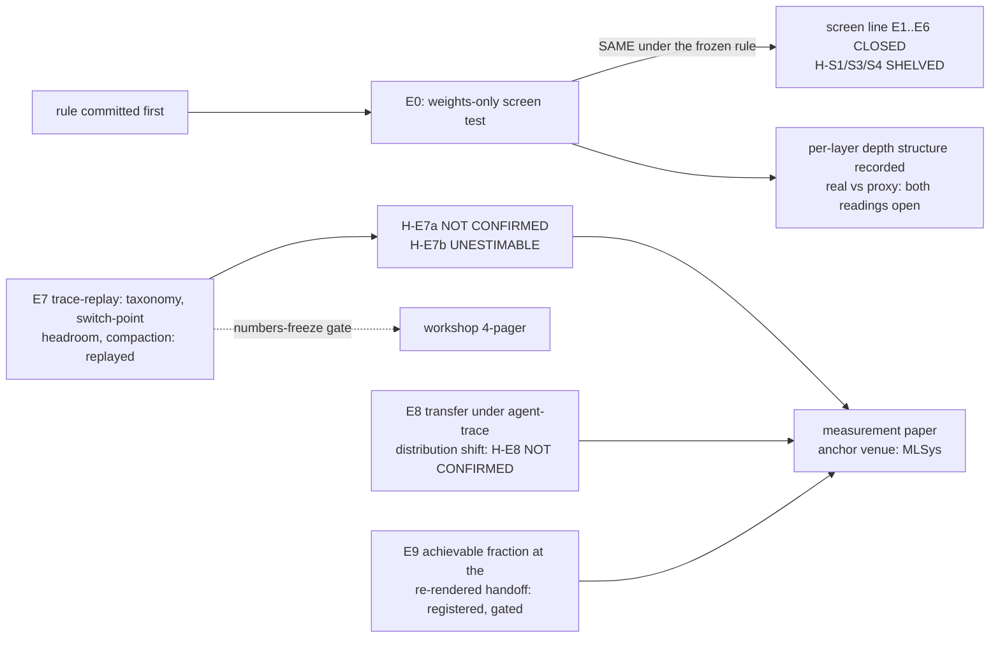
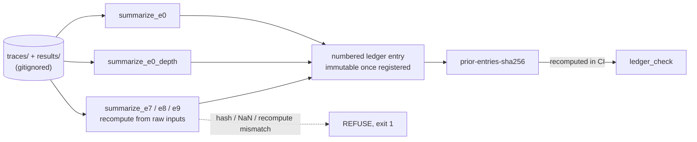
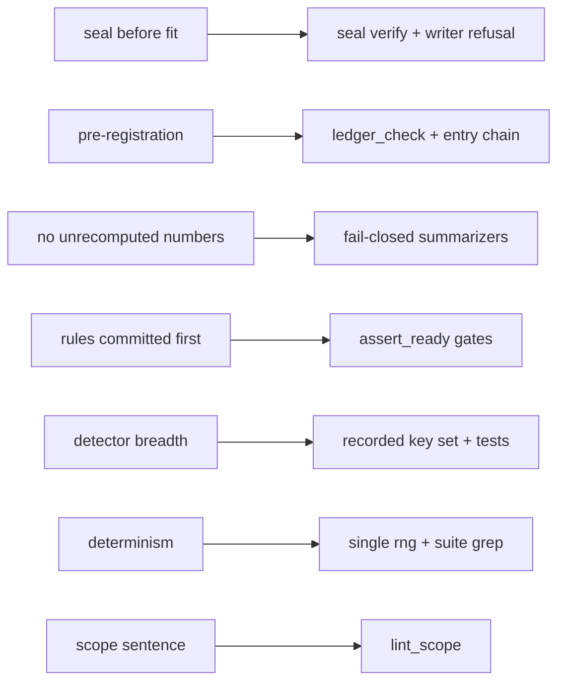
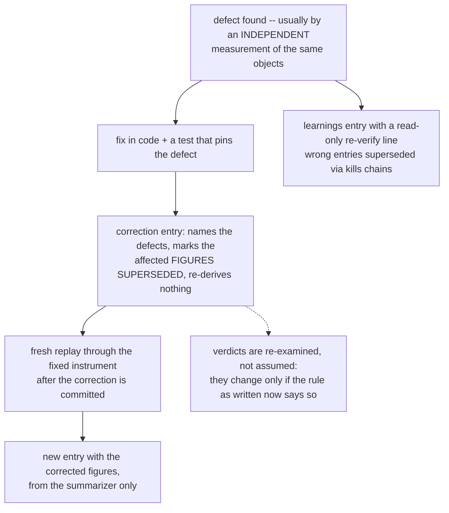

# Background: the discipline, the program history, and why the record looks the way it does

This is the material a first-time reader does not need on page one but a careful reviewer will
want before trusting anything: how a number becomes a claim here, what the invariants are and
what enforces each, what happens when the instrument itself is wrong, and how the program got
its current shape. The README stays minimal; this file carries the machinery.

## Program history in one diagram

Two program lines have lived in this repo. The **sealed pre-fit screen** ran (E0) and its line
was closed on opportunity-cost grounds; the **trace-replay measurement program** (E7–E9) is the
live work. The ledger entries named below are the authority on every claim here.

## How a number becomes a claim

Nothing enters the ledger by hand. `results/` and `traces/` are gitignored; the only path from
computation to record is a summarizer that **recomputes from the raw inputs and refuses on any
disagreement** — proven by tamper tests, not asserted. Each entry then hash-chains the
registered text above it, so editing a registered entry fails CI.

Refusal is layered, and each layer fails closed rather than guessing:

1. **Gates refuse to run** — an experiment reads no data until its registering entries and
   config are committed unmodified (and, where an upstream is invoked, until the upstream pin
   holds: the pinned commit is an ancestor of HEAD, the invoked paths are unchanged since the
   pin, and the working tree is clean for them).
2. **Adapters refuse to guess** — an unknown trace shape, a missing request boundary, or an
   argument type that cannot be priced raises instead of approximating; what no adapter accepts
   is recorded as unparsed, never dropped.
3. **Summarizers refuse to summarize** — config drift, a changed/added/missing input file, a
   NaN, a recorded value the recomputation does not reproduce, or a report section from an
   older driver each name their reason and exit nonzero.
4. **Measurability refuses the flattering zero** — every class of event carries its own NOT
   MEASURABLE state; a trace that cannot evidence a thing never counts as evidence of its
   absence.

## Hard invariants, and what enforces each

1. **Seal before fit** — the seal writer refuses if a fitted mapper exists; CI's `seal verify`
   proves hash integrity and commit immutability only, never the pre-fit ordering itself
   (that is proved by the writer's refusal, on a machine that sees the upstream).
2. **Pre-registration** — verdicts stated against the rule as written; amendments are new
   numbered entries; the entry chain makes silent edits to registered text fail CI. The
   header/table above `## Entries` are editable commentary outside the chain, and a history
   rewrite that regenerates chain or seal is locally undetectable.
3. **No unrecomputed numbers** — summarizers only, fail-closed, tamper-tested.
4. **Experiments refuse until their rules are committed** — the E0/E7/E8/E9 runners read no
   data until the registering entries and their config are committed and unmodified.
5. **A narrow detector is a defect, never a null** — a probe that cannot see a thing must not
   report its absence; Lane A records the key set it searched alongside its counts.
6. **Determinism** — one seeded generator (`rng.make_rng`); the suite greps for any other.
7. **Scope sentence verbatim, once, in the README** — `lint_scope`.

## When the instrument is wrong

The discipline above assumes the code can be wrong and is built to survive it. A defect in an
adapter or a measure is handled the same way every time — nothing is edited, nothing deleted:

Two properties make this trustworthy rather than cosmetic. **Figures and verdicts are
superseded separately** — a wrong number does not silently drag a verdict with it, and a verdict
that survives a correction is stated as surviving, with the corrected margin. And **a
summarizer that shares the adapter with the driver proves the arithmetic, not the reading** —
which is why load-bearing claims also get cross-checked against an independent view of the same
object (provider-reported usage, an archived result file, a second tokenization) whenever one
exists. The ledger's entry 0017 is this loop executed for real: two adapter/measure defects
found by an independent measurement, figures superseded, verdicts re-derived and unchanged.

## Two properties of the corpora that shape every figure

Serving-model identity is recorded per step by only a minority of trace formats, so most
trajectories are **not measurable** for switch-point analysis and are never counted as zero.
And public traces omit the system prompt and tool schemas the provider billed, so **every cost
figure computed from visible messages is a lower bound** — the omitted block is byte-identical
per request, i.e. the most cacheable content there is. Both are registered; the measured basis
is in the ledger (entries 0012, 0014, 0015).

## Vocabulary

Status tags on entries: `[VALIDATED]` ran and survived refutation · `[BASELINE]` ran, numbers
in the ledger · `[STRETCH]` designed, not run · `[FUTURE]` not designed · `[SUPERSEDED]`.
Hypothesis verdicts: `unresolved` · `HELD` · `NOT CONFIRMED` · `WITHDRAWN` · `SUPERSEDED` ·
`SHELVED` (no experiment ran) · `UNESTIMABLE` (ran; the estimand has no support in the corpus).
